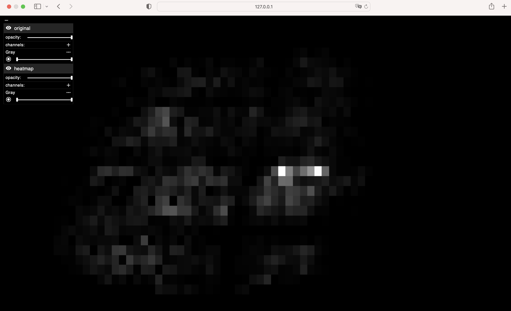

# AI-Enhanced Tuberculosis Sputum Image Visualization Tool

## About
This project provides a tool for visualizing whole slide images of sputum samples from patients suspected of having tuberculosis. 
Leveraging AI-enhanced analysis, the tool utilizes Convolutional Neural Network to automatically identify and locate tuberculosis bacilli within the slide image. 
This can assist pathologists in quickly identifying regions of interest that are highly indicative of TB presence, streamlining the diagnostic process.

## Features
- **Whole Slide Image Upload**: Whole Slide Image Upload: Users can upload whole slide images (.CZI) of sputum samples.
- **Preprocessing and AI Analysis**: The backend performs preprocessing techniques and AI-enhanced analysis using a CNN to detect and count tuberculosis bacilli.
- **Bacilli Detection**: The CNN analyzes the image, identifying the number of tuberculosis bacilli and their locations.
- **Heatmap Visualization**: A heatmap is generated to show the density and distribution of the bacilli on the slide.
- **Image and Heatmap View**: Both the original image and the corresponding heatmap are visualized for easy comparison.

## Example Use Case


## Screenshots


## Setup and Installation

### Prerequisites
- Node.js (v22.11.0)
- Python 3.11
- Poetry (1.8.4)

### Installation
1. Clone the repository.
2. Inside TB_VIZ run:
    ```
   git clone https://github.com/hms-dbmi/vizarr.git TB_Frontend
   ```
   ```
   cd TB_Frontend
   ```
   ```
    git checkout d70b0c9ab86acfcd79fd4bbb61f076bd122cb3cc
    ```
3. Replace `main.ts` from Frontend into TB_Frontend, add `.env`from Frontend to TB_Frontend
   
4. Inside TB_Frontend run:
    ```
    npm install --legacy-peer-deps  // if needed: sudo npm install --legacy-peer-deps
    ```
   ```
   npm install -g http-server // if needed: sudo npm install -g http-server
   ```
   ```
    npm run build
   ```
5. Inside TB_Backend run:
    ```
    poetry install
    ```
### Running the Application

1. Inside TB_Frontend run:
    ```
    npx http-server ./dist -p 8080

    ```
2. Inside TB_Backend run:
    ```
    poetry shell
    ```
    ```
   uvicorn main:app --reload --port 8000
    ```
3. Open a web browser and go to `http://localhost:8080` to access the application.
4. Follow the instructions on the web page to upload a whole slide image (.CZI)

## Acknowledgements
The Backend of this project is mostly based on the following repository: [TBProject](https://github.com/matteo-cadoni/TBProject).

The Frontend is mostly based on the following repository: VIZARR [VIZARR](https://github.com/hms-dbmi/vizarr)